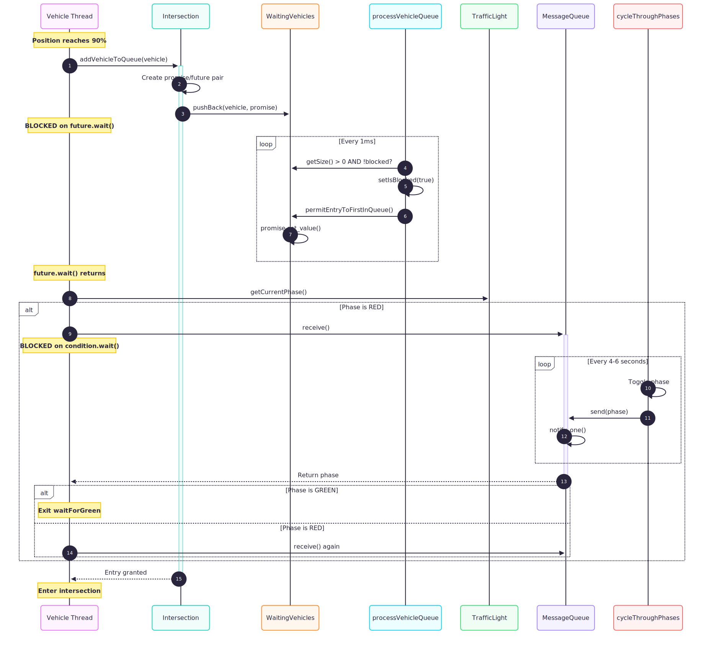

# Concurrent Traffic Simulation

A multithreaded traffic simulation implementing thread-safe communication between vehicles, intersections, and traffic lights using modern C++ concurrency primitives.

<p align="center">
  
</p>

<p align="center">
  <a href="#features">Features</a> •
  <a href="#architecture">Architecture</a> •
  <a href="#getting-started">Getting Started</a> •
  <a href="#usage">Usage</a> •
  <a href="#implementation">Implementation</a>
</p>

---

## Overview

This project simulates urban traffic flow where multiple vehicles navigate through a city grid, respecting traffic lights at intersections. Each component (vehicles, intersections, traffic lights) operates in its own thread, demonstrating real-world concurrent programming patterns.

### Key Challenges Solved

| Challenge | Solution |
|-----------|----------|
| Multiple vehicles accessing shared intersection | Thread-safe queue with mutex protection |
| Vehicles waiting for traffic lights | Producer-consumer pattern with condition variables |
| Coordinating traffic light state changes | Message queue with move semantics |
| Clean thread lifecycle management | RAII pattern with automatic thread joining |

---

## Features

- **Concurrent Architecture**: Each vehicle, intersection, and traffic light runs in its own thread
- **Thread-Safe Communication**: Message queues enable safe data exchange between threads
- **Dynamic Traffic Lights**: Random cycle duration (4-6 seconds) for realistic simulation
- **Visual Output**: Real-time rendering with OpenCV, exported to MP4 video
- **Configurable Simulation**: Adjustable duration, vehicle count, and city map

---

## Architecture

```
┌─────────────────────────────────────────────────────────────────────────────┐
│                              MAIN THREAD                                    │
│  Creates: 9 Intersections → 8 Streets → 6 Vehicles → Starts Simulation      │
└─────────────────────────────────────────────────────────────────────────────┘
                                    │
            ┌───────────────────────┼───────────────────────┐
            ▼                       ▼                       ▼
    ┌───────────────┐      ┌───────────────┐      ┌───────────────┐
    │   Vehicle     │      │  Intersection │      │ TrafficLight  │
    │   Threads     │      │    Threads    │      │   Threads     │
    │   (×6)        │      │    (×9)       │      │    (×9)       │
    ├───────────────┤      ├───────────────┤      ├───────────────┤
    │ • drive()     │ ──── │ • process     │ ──── │ • cycle       │
    │ • Move along  │      │   VehicleQ()  │      │   Phases()    │
    │   streets     │      │ • Grant entry │      │ • Toggle      │
    │ • Request     │      │   permission  │      │   red/green   │
    │   entry       │      │               │      │ • Send to     │
    └───────────────┘      └───────────────┘      │   queue       │
            │                       │             └───────────────┘
            │                       │                      │
            └───────────────────────┴──────────────────────┘
                                    │
                    ┌───────────────┴───────────────┐
                    │     SYNCHRONIZATION LAYER     │
                    ├───────────────────────────────┤
                    │ • std::mutex                  │
                    │ • std::condition_variable     │
                    │ • std::promise / std::future  │
                    │ • MessageQueue<T>             │
                    └───────────────────────────────┘
```
### Class Hierarchy




### Vehicle Entry Sequence




### Traffic light State machine


---

## Getting Started

### Prerequisites

| Dependency | Version | Installation |
|------------|---------|--------------|
| CMake | ≥ 2.8 | [cmake.org/install](https://cmake.org/install/) |
| Make | ≥ 4.1 | Pre-installed on Linux/Mac |
| OpenCV | ≥ 4.1 | See below |
| GCC/G++ | ≥ 5.4 | Pre-installed on Linux/Mac |

#### OpenCV Installation

**Ubuntu/Debian:**
```bash
sudo apt update
sudo apt install libopencv-dev
```

**macOS (Homebrew):**
```bash
brew install opencv
```

**Windows:**
Download from [opencv.org](https://opencv.org/releases/) and add to PATH.

### Build Instructions

```bash
# Clone the repository
git clone https://github.com/zcoulibalyeng/concurrent-traffic-light-simulation.git
cd concurrent-traffic-light-simulation

# Create build directory
mkdir build && cd build

# Configure and build
cmake ..
make
```

---

## Usage

### Basic Run

```bash
./traffic_simulation
```

### Command Line Options

```
./traffic_simulation [options]

Options:
  --city <name>       City map: paris (default) or nyc
  --duration <sec>    Simulation duration in seconds (default: 30)
  --vehicles <num>    Number of vehicles (default: 6)
  --output <file>     Output video file (default: traffic_simulation.mp4)
  --help              Show help message
```

### Examples

```bash
# 60-second Paris simulation
./traffic_simulation --duration 60

# NYC with 10 vehicles
./traffic_simulation --city nyc --vehicles 10 --duration 45

# Custom output file
./traffic_simulation --output my_simulation.mp4
```

### Output

The simulation generates:
- **Console logs**: Thread IDs, vehicle entries/exits, intersection states
- **Video file**: Visual representation saved to `data/traffic_simulation.mp4`

---

## Implementation

### Completed Tasks

#### Task FP.1: TrafficLight Class Definition
```cpp
enum class TrafficLightPhase { red, green };

class TrafficLight : public TrafficObject {
public:
    TrafficLightPhase getCurrentPhase();
    void waitForGreen();
    void simulate() override;
private:
    void cycleThroughPhases();
    TrafficLightPhase _currentPhase;
    MessageQueue<TrafficLightPhase> _messageQueue;
};
```

#### Task FP.2: Phase Cycling Implementation
- Infinite loop with 1ms sleep intervals
- Random cycle duration between 4-6 seconds
- Thread spawned via `threads.emplace_back()`

#### Task FP.3: MessageQueue Template Class
```cpp
template <typename T>
class MessageQueue {
public:
    void send(T &&msg);
    T receive();
private:
    std::deque<T> _queue;
    std::mutex _mutex;
    std::condition_variable _condition;
};
```

#### Task FP.4: Send Method with Notification
```cpp
void send(T &&msg) {
    std::lock_guard<std::mutex> lock(_mutex);
    _queue.push_back(std::move(msg));
    _condition.notify_one();
}
```

#### Task FP.5: Receive with Condition Wait
```cpp
T receive() {
    std::unique_lock<std::mutex> lock(_mutex);
    _condition.wait(lock, [this]{ return !_queue.empty(); });
    T msg = std::move(_queue.front());
    _queue.pop_front();
    return msg;
}
```

#### Task FP.6: Intersection Integration
```cpp
void Intersection::simulate() {
    _trafficLight.simulate();  // Start traffic light thread
    threads.emplace_back(&Intersection::processVehicleQueue, this);
}

void Intersection::addVehicleToQueue(std::shared_ptr<Vehicle> vehicle) {
    // ... wait for queue permission ...
    if (_trafficLight.getCurrentPhase() == TrafficLightPhase::red) {
        _trafficLight.waitForGreen();
    }
}
```

---

## Project Structure

```
CppND-Traffic-Simulation/
├── CMakeLists.txt
├── README.md
├── data/
│   ├── paris.jpg              # Paris city map
│   ├── nyc.jpg                # NYC city map
│   └── traffic_simulation.mp4 # Output video
└── src/
    ├── TrafficSimulator-Final.cpp  # Main entry point
    ├── TrafficObject.h/cpp         # Base class with thread management
    ├── TrafficLight.h/cpp          # Traffic light + MessageQueue
    ├── Intersection.h/cpp          # Intersection + WaitingVehicles
    ├── Vehicle.h/cpp               # Vehicle movement logic
    ├── Street.h/cpp                # Street connections
    └── Graphics.h/cpp              # OpenCV rendering
```

---

## Concurrency Concepts Demonstrated

| Concept | Usage |
|---------|-------|
| **std::thread** | Each vehicle, intersection, and traffic light runs in its own thread |
| **std::mutex** | Protects shared data in WaitingVehicles and MessageQueue |
| **std::lock_guard** | RAII lock in `send()` for automatic unlock |
| **std::unique_lock** | Flexible lock in `receive()` for condition variable |
| **std::condition_variable** | Efficient blocking in MessageQueue until data available |
| **std::promise/future** | One-time signal for vehicle entry permission |
| **Move Semantics** | Efficient message passing with `std::move()` |
| **RAII Pattern** | Automatic thread joining in TrafficObject destructor |

---

## Performance Considerations

- **1ms Sleep Intervals**: Prevents CPU spinning while maintaining responsiveness
- **Condition Variables**: Efficient blocking vs. busy-waiting (polling)
- **Move Semantics**: Zero-copy message passing where possible
- **Thread Pool Pattern**: Threads stored in vector for lifecycle management

---

## Troubleshooting

### Common Issues

**Build fails with "OpenCV not found"**
```bash
# Ubuntu
sudo apt install libopencv-dev

# macOS
brew install opencv
export OpenCV_DIR=$(brew --prefix opencv)/lib/cmake/opencv4
```

**"Can't open/read file: paris.jpg"**
```bash
# Run from build directory
cd build
./traffic_simulation

# Or set working directory in IDE to build/
```

**Simulation appears frozen**
- Normal behavior: vehicles wait 4-6 seconds for traffic light cycles
- First vehicle may take up to 10 seconds to cross central intersection

---

## License

This project is licensed under the MIT License - see the [LICENSE](LICENSE.md) file for details.

---

## Acknowledgments

- [Udacity C++ Nanodegree Program](https://www.udacity.com/course/c-plus-plus-nanodegree--nd213)
- OpenCV for visualization capabilities
- Paris and NYC map images

---

<p align="center">
  Built with C++17 | Concurrency | OpenCV
</p>